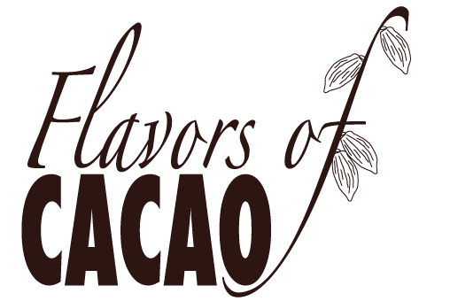
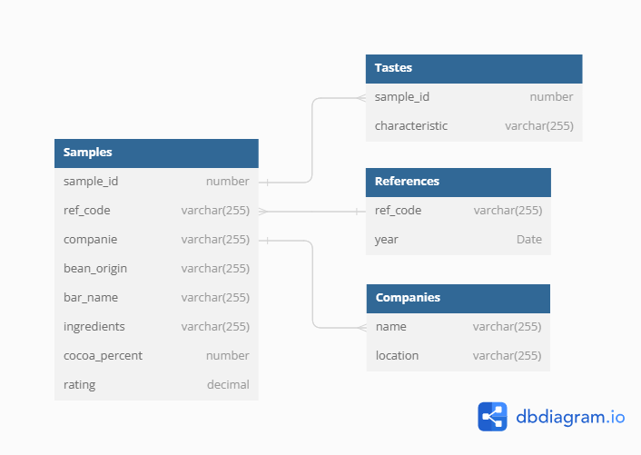

# Exploratory Data Analysis
## Workshop

---

## Motivation

---

## Motivation
 **Understanding the Data Distribution**

---

## Motivation
 **Understanding the Data Distribution**

 **Identifying Patterns and Relationships**

---

## Motivation
 **Understanding the Data Distribution**

 **Identifying Patterns and Relationships**

 **Data Cleaning and Preprocessing**

---

## Motivation
 **Understanding the Data Distribution**

 **Identifying Patterns and Relationships**

 **Data Cleaning and Preprocessing**

 **Hypothesis Generation** 

---

### Dataset: Flavors Of Cacao
https://flavorsofcacao.com/chocolate_database.html

---

### Dataset: Flavors Of Cacao
### Questions
1. What is the origin of the best cocoa beans

---

### Dataset: Flavors Of Cacao
### Questions
1. What is the origin of the best cocoa beans
2. What are the flavors that makes the best chocolate

---

### Dataset: Flavors Of Cacao
### Questions
1. What is the origin of the best cocoa beans
2. What are the flavors that makes the best chocolate
3. What ingredients go into the best chocolate

---

### Hands-on
 Open **eda-workshop/src/eda_cocoa.ipynb** 

---

### Data schema

---

### Cacao origins

---

### Cacao Flavors

---

### Cacao Ingredients

---

# Bye

**Ben Sivan**
Data Scientist

+972-546925522
ben.sivan@celleste-bio.com
